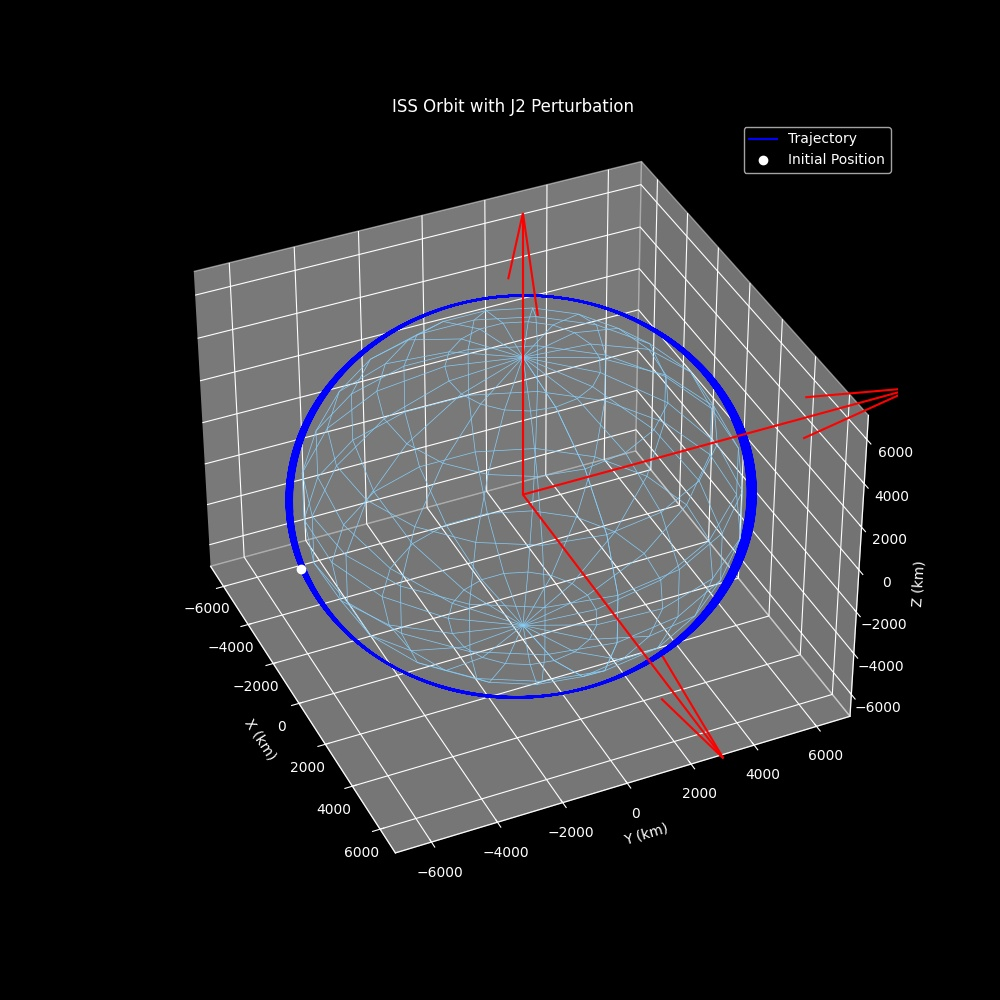
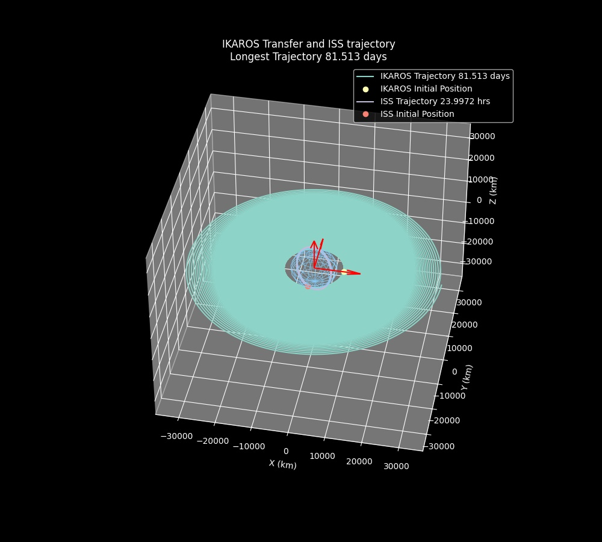

# DSE-SBSP-2020
Code repository for group 2 of the DSE in fall 2020 with the topic of Space Based Solar Power

Congratulations! You just wasted your time reading a stupid readme file!

# Data
All relevant data should be kept here, obviously. When you write a file in another directory you can use the *utils.py* function *get_data_root()* to get the path to this directory and access it. You will probably have to convert this path to a string for most import functions.

# Utils
This python file contains utility classes and functions that can be used for the project.
*get_project_root()* returns a path to the root of the project.
*get_data_root()* returns a path to the data directory.

## DataHandling
The DataHandling class is initiated simply with the path to the data directory, this path can be altered to save data to another location if desired.  

*import_centre_body()* provides a function to import central body data for a given planet or object from the *planetary_data.csv* file.  

*save_figure()* simply saves a matplotlib figure type as either a jpg or png depending on the filetype used (defaults to jpg). If a png is used, it defaults to 300dpi so the resolution is quite high (and hence only jpg is found in github). An alternative path can be passed to the function if you do not want to save the figure in a /figures directory within whichever data_path the class was initiated with.

## AstroUtils
This class stores methods that are specific to the astrodynamics and orbit propagation problem, as to keep it separate from other functions in the Utils.py file. Most of these methods are static and the class is not initiated with any variables, it is then subclassed by the OrbitPropagation class so that these methods can be easily used there (this structure may change at a later stage but it works for now so whatever).

# Astropy
## Orbital Propagation Class
An instance of this class requires the initial conditions of the orbit; position, velocity, mass, time=0. It also requires data concerning the centre body, which in most cases for this project will be Earth. If a transfer calculation is required, simply input the optional 'target' argument and the propagator will run either until this target or the time span is reached.

This class defines five methods: *propagate_orbit, diffy_g, calculate_coes, plot_coes, plot_3d*.

The *calculate_coes* function takes in the rs and vs of the orbit propagator class and converts them to classical orbital elements.

### Example
```
from src.utils import *
from src.utils import AstroUtils as au
cb_data = DataHandling().import_centre_body()

# Choose orbital body to get data from
data = cb_data['earth']

# ISS
# State input format
# Altitude, Eccentricity, Inclination, True anomaly, Argument of Perigee, Right Acsension of Ascending Node

iss = au.make_sat([data['radius'] + 418, 0.0000933, 51.6444, 0.0, 193.3222, 77.2969],
                  'ISS',
                  419000.0,
                  au.init_perts(J2=True, isp=4300, thrust=0.327),
                  None)

# Time span of two days
tspan = 3600 * 24.0 * 2.0

# Creat instances
iss0 = OrbitPropagator(state0=iss['state'],
                       tspan=tspan,
                       dt=10.0,
                       target=iss['target'],
                       coes=True,
                       deg=True,
                       mass0=iss['mass'],
                       cb=data,
                       perts=iss['perts'])

iss0.plot_3d(show_plot=True, save_plot=True, title="ISS Orbit with J2 Perturbation"
```


## Plotting multiple orbits
You can plot multiple orbits using the *plot_n_orbits* function in *utils.py*.

### Example
```
from src.utils import *  
cb_data = DataHandling().import_centre_body()

# Choose orbital body to get data from
data = cb_data['earth']

# COEs input
# Altitude, Eccentricity, Inclination, True anomaly, Argument of Perigee, Right Acsension of Ascending Node

ikaros = au.make_sat([data['radius'] + 1750, 0.0, 0.0, 0.0, 0.0, 0.0],
                     'IKAROS',
                     10000.0,
                     au.init_perts(J2=True, isp=5000, thrust=5.0),
                     3500.0, )

iss = au.make_sat([data['radius'] + 418, 0.0000933, 51.6444, 0.0, 193.3222, 77.2969],
                  'ISS',
                  419000.0,
                  au.init_perts(J2=True, isp=4300, thrust=0.327),
                  None)

# Create instances
ikaros0 = OrbitPropagator(state0=ikaros['state'],
                          tspan=3600 * 24 * 365,
                          dt=10.0,
                          target=ikaros['target'],
                          coes=True,
                          deg=True,
                          mass0=ikaros['mass'],
                          cb=data,
                          perts=ikaros['perts'])

iss0 = OrbitPropagator(state0=iss['state'],
                       tspan=3600 * 24 * 2.0,
                       dt=10.0,
                       target=iss['target'],
                       coes=True,
                       deg=True,
                       mass0=iss['mass'],
                       cb=data,
                       perts=iss['perts'])

au.plot_n_orbits([ikaros0.rs, iss0.rs],
                 labels=[
                     f"{ikaros['name']} Trajectory {au.get_orbit_time(ikaros0.ts, [0, 0, 1])} days",
                     f"{iss['name']} Trajectory {au.get_orbit_time(iss0.ts)} hrs"],
                 show_plot=True,
                 save_plot=False,
                 title=f"{ikaros['name']} Transfer and {iss['name']} trajectory"
                       f"\nLongest Trajectory {max(au.get_orbit_time(ikaros0.ts, [0, 0, 1]), au.get_orbit_time(iss0.ts, [0, 0, 1]))} days")
```

