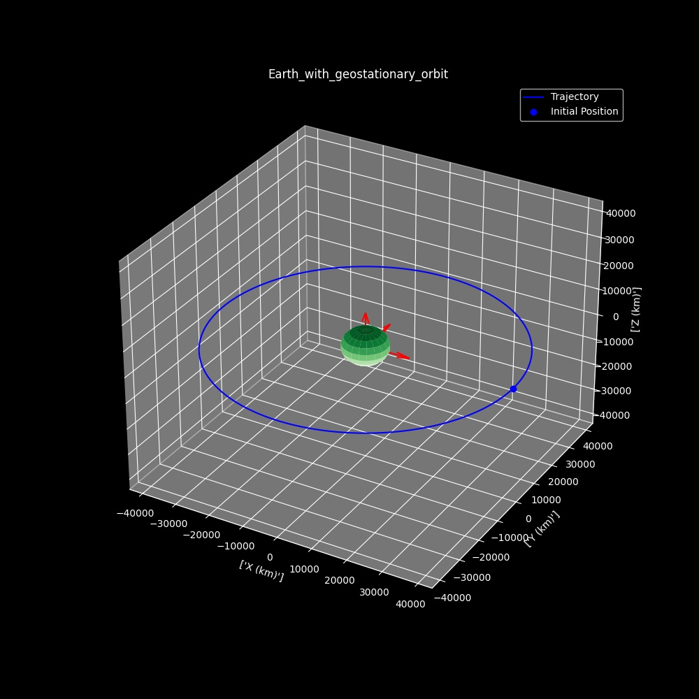

# DSE-SBSP-2020
Code repository for group 2 of the DSE in fall 2020 with the topic of Space Based Solar Power

Congratulations! You just wasted your time reading a stupid readme file!

# Data
All relevant data should be kept here, obviously. When you write a file in another directory you can use the Utils function get_data_root() to get the path to this directory and access it. You will probably have to convert this path to a string for most import functions.

# Astropy
## Orbital Propagation Class
An instance of this class requires the initial conditions of the orbit; position, velocity, time=0. It also requires data concerning the centre body, which in most cases for this project will be Earth.

This class defines three methods: propagate_orbit, diffy_g, plot_3d.

### Example
from src.utils import *  
data_root = str(get_data_root())

// Choose orbital body to get data from

data = import_data('earth')

// First orbiting body

r_mag = data['radius'] + 35786.0  
v_mag = np.sqrt(data['mu'] / r_mag)  
r0 = [r_mag, r_mag * 0.01, 0]  
v0 = [0, v_mag, v_mag * 0.5]  

orbit = OrbitPropagator(r0, v0,  
                         tspan=3600 * 10,  
                         dt=10.0,  
                         cb=data)  

orbit.propagate_orbit()  
orbit.plot_3d(show_plot=True, save_plot=False, title="Earth_with_geostationary_orbit")  

